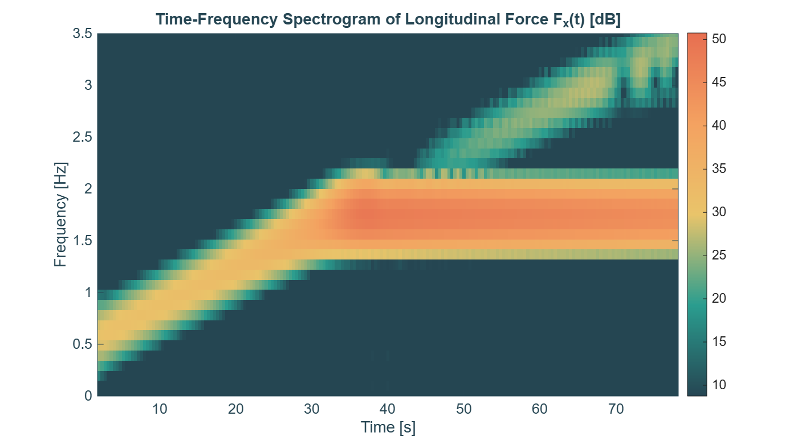
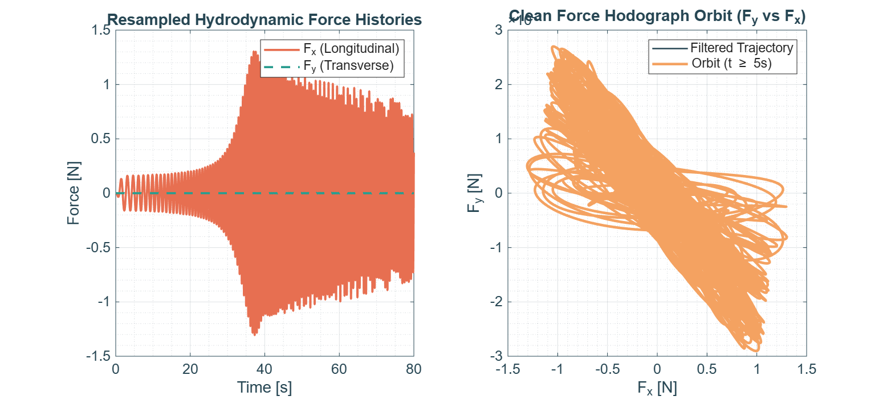
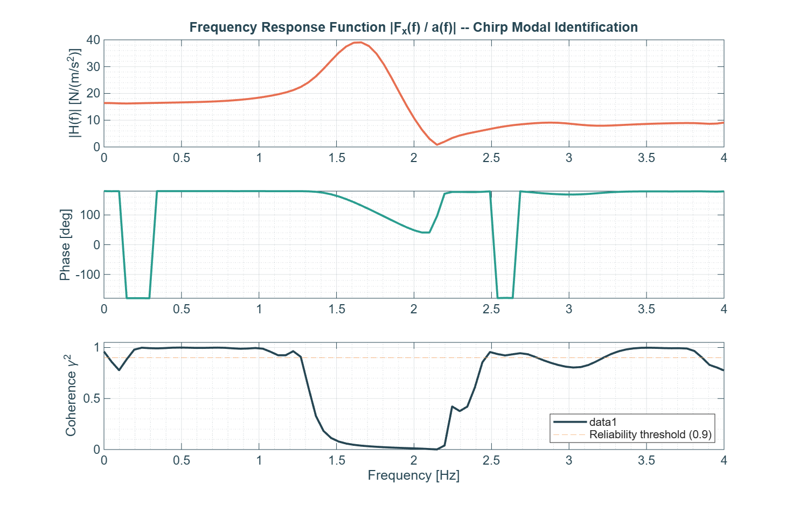
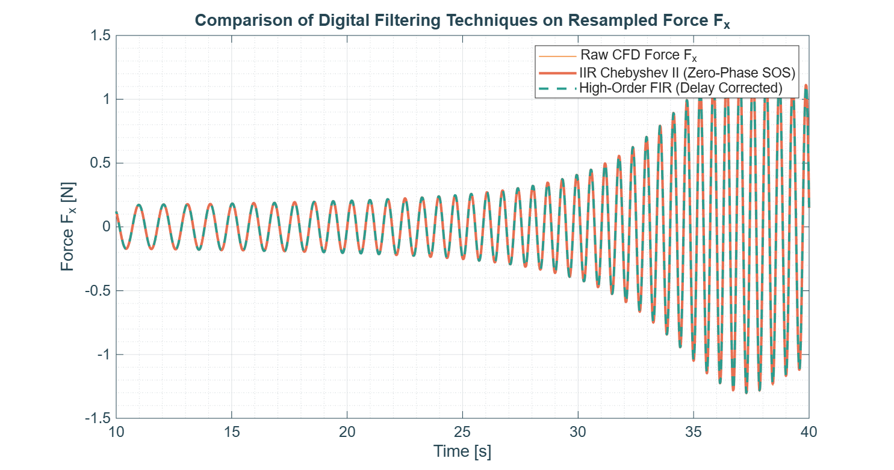

# Case 0 — Broadband Chirp Modal Identification


Part of the [3D Resonant Sloshing in an Upright Cylindrical Tank](../README.md) CFD campaign.

---

## 1. Objective

Identify the tank's fundamental sloshing natural frequency $f_{11}$ and the shape of its frequency-response function $H(f) = F_x(f)/a(f)$ directly from CFD, using a broadband linear frequency sweep (chirp) instead of running many separate constant-frequency cases. This case is the campaign's modal-identification reference, used to cross-check the analytical $f_{11}$ against the actual (numerically damped, AMR-discretized) system response.

## 2. Analytical Setup

### Geometry & Fluid Properties

- Tank radius $R_0 = 0.15\text{ m}$ (diameter $D = 0.30\text{ m}$)
- Liquid filling height $h = 0.225\text{ m}$ ($h/R_0 = 1.5$, hard-spring regime, same geometry as Case1-4/6/7)
- Fluid: water ($\rho = 998\text{ kg/m}^3$, $\nu = 1.0\times10^{-6}\text{ m}^2/\text{s}$)
- Gravity $g = 9.81\text{ m/s}^2$

### Theoretical Natural Frequency

$$
\sigma_{11}^2 = \frac{g\,k_{11}}{R_0}\tanh\!\left(\frac{k_{11}\,h}{R_0}\right), \qquad k_{11}=1.84118
$$

$$
\sigma_{11} \approx 10.9283\text{ rad/s} \implies f_{11} = \frac{\sigma_{11}}{2\pi} \approx \mathbf{1.7393\text{ Hz}}
$$

### Forcing Parameters (Linear Chirp)

| Parameter | Value |
|---|---|
| Sweep type | Linear chirp, $f(t) = f_{\text{start}} + k\,t$ |
| Start frequency | 0.5 Hz |
| End frequency | 3.5 Hz |
| Sweep rate, $k$ | 0.0375 Hz/s |
| Forcing amplitude, $a_0/g$ | 0.001 (kept deliberately small to stay linear across the whole sweep, including at resonance) |
| Forcing amplitude, $a_0$ | 0.00981 m/s² |
| Start/end taper | Tukey window, 5% at each end (avoids the broadband noise a hard on/off step would inject) |
| Simulated time | 80 s |

`generate_acceleration.py` also writes `constant/chirp_f_inst.csv` (instantaneous sweep frequency vs. time), used only as a cross-check reference against the STFT ridge — it is not read by the solver.

## 3. Directory Contents

```
Case0_Chirp/
├── 0.orig/                     # Initial fields (U, p_rgh, alpha.water)
├── constant/                   # Mesh, physicalProperties, dynamicMeshDict,
│                                #   acceleration.dat + chirp_f_inst.csv (generated)
├── system/                     # blockMeshDict, controlDict, fvSchemes, fvSolution
├── FORCES/                     # force.dat, moment.dat, alpha.water, p_rgh (merged)
├── generate_acceleration.py    # Builds the chirp acceleration table
├── Allrun / TabulaRasa         # Case execution / clean scripts
├── launch.slurm                # Slurm batch submission script
├── Errata.slurm                # Re-extracts FORCES from existing time-steps via
│                                #   `postProcess -time 'a:b'`, without rerunning the
│                                #   solver — see §6 for when this is needed
├── fig1-fig6, fig8_*.png       # Figures generated by ../process_sloshing_data.m
└── README.md                   # This file
```

## 4. Execution Workflow

```bash
cd Case0_Chirp/
python3 generate_acceleration.py
sbatch launch.slurm
```

Then, from this directory:

```matlab
process_sloshing_data
```

`process_sloshing_data.m` (campaign root) auto-detects this case by folder name (matches `Chirp`) and runs the `FrequencyResponse` branch (Section 11): it reconstructs the chirp input $a(t)$ from `constant/acceleration.dat`, estimates $H(f)$ and coherence $\gamma^2(f)$ via Welch's method (`tfestimate`/`mscohere`), and produces `fig8_frequency_response_function.png` in addition to the standard 6 figures.

## 5. Results

### 5.1 Spectrogram — sweep tracking and resonance bulge

| Time-Frequency Spectrogram |
|:---:|
|  |

The energy ridge tracks the commanded linear sweep cleanly from ~0.3 Hz at $t=0$ up past 3 Hz by $t=80$s. There is a clear amplitude bulge (brightest band) as the ridge crosses $f\approx1.6$–$1.8$ Hz around $t\approx30$–$45$ s — the sweep dwelling near $f_{11}$. A fainter secondary ridge appears above the main one for $t\gtrsim45$ s, consistent with mild harmonic content excited while the response amplitude is largest.

### 5.2 Force history & hodograph

| Resampled Forces & Hodograph |
|:---:|
|  |

$F_x(t)$ grows from the noise floor to a peak of $\approx\pm1.3$ N around $t\approx35$–38 s (the resonance crossing), then decays as the sweep moves past $f_{11}$, settling to $\approx\pm0.7$–1 N by $t=80$ s — the textbook shape of a lightly-damped linear oscillator swept through resonance. $F_y$ stays flat at zero for the full run: $a_0/g=0.001$ is small enough that no transverse/swirling instability is triggered, which is intentional (this case targets linear identification, not modal coupling — see Case2/Case3 for that).

### 5.3 Frequency response function — resonance identified, coherence caveat near the peak

| Frequency Response Function |
|:---:|
|  |

$|H(f)|$ peaks at $f\approx1.6$–1.7 Hz with $|H|_{\max}\approx39\ \text{N/(m/s}^2)$, in good agreement with the analytical $f_{11}=1.7393$ Hz. **However**, the coherence $\gamma^2(f)$ drops well below the 0.9 reliability threshold (down toward 0) across roughly 1.4–2.1 Hz — right where the peak itself sits.

This is a known limitation of swept-sine FRF estimation, not a data-quality bug: a chirp is non-stationary, and Welch-style windowed coherence degrades where the instantaneous frequency changes appreciably within one analysis window, which is exactly what happens near a lightly-damped resonance. Using the damping ratio identified independently in `Case7_Free_Decay_OffResonance` ($\xi\approx1.7\%$), the modal decay time constant is $\tau = 1/(\xi\,\sigma_{11})\approx5.4$ s, while the sweep here crosses the half-power bandwidth ($\approx0.059$ Hz) in only $\approx1.6$ s — i.e. **the sweep rate (0.0375 Hz/s) is fast relative to how long the resonance needs to ring up**, which both broadens/underestimates the peak and depresses coherence there. A slower sweep (or a dedicated narrow-band sweep around 1.5–2.0 Hz) would tighten this up if a more precise $f_{11}$/damping estimate from this method specifically is ever needed; for now, `Case7`'s free-decay result is the more reliable damping estimate, and this case's peak frequency is treated as a qualitative cross-check, not a precision measurement.

### 5.4 Filter comparison — clean, artifact-free data

| Digital Filter Comparison |
|:---:|
|  |

Raw, IIR (Chebyshev II, zero-phase), and FIR filtered traces overlay with no spikes or discontinuities anywhere in the shown window — this run is clean (see §6 for why that wasn't always true).

## 6. Known Issues Found & Fixed During This Case's Validation

This case went through several rounds of debugging before the dataset above could be trusted; kept here as a record in case similar symptoms show up in other cases:

1. **Courant/AMR blowup at $t\approx7.32$ s** (original run, pre-fix settings): `Courant Number max` jumped from 0.52 to 1247 in a single step, coincident with a mesh refine/unrefine event and `min(alpha)` briefly going negative (-0.035) — a transient VOF/AMR instability, not a real hydrodynamic load. Fixed campaign-wide by tightening `controlDict` (`maxCo 0.5→0.3`, `maxAlphaCo 0.5→0.2`, `maxDeltaT 0.005→0.002`) and `dynamicMeshDict` (`refineInterval 5→1`, `nBufferLayers 1→2`).
2. **Stale `postProcessing/` after relaunch**: `TabulaRasa`'s cleanup never removed `postProcessing/`, so `Allrun`'s `cat postProcessing/wallForces/*/force*.dat` kept re-concatenating the *original* contaminated segment (identical to the decimal) alongside genuinely new data from later relaunches, even after the dictionaries above were corrected. Fixed by adding `postProcessing` to every case's `TabulaRasa` cleanup list.
3. **`postProcess -time ':'` silently does nothing**: the bare `':'` range is rejected (`Bad scalar-range parsing`), causing `postProcess` to fall back to only the `constant` pseudo-time — i.e. it does not raise a hard error, it just processes nothing. Use an explicit bounded range instead, e.g. `-time '0:80'` for this case (see `Errata.slurm`).

The dataset behind the figures in §5 (`FORCES/` dated 2026-09-02) postdates all three fixes and was verified to contain **zero** local-jump force outliers across the full $t\in[0,80]$ s range.

## 7. Configuration Summary

| Parameter | Value |
|---|---|
| Tank radius ($R_0$) | 0.15 m |
| Liquid level ($h$) | 0.225 m |
| Natural freq. ($f_{11}$), analytical | 1.7393 Hz |
| Identified resonance peak, $H(f)$ | ≈1.6–1.7 Hz (coherence-limited, see §5.3) |
| Damping ratio (from Case7, used here as reference) | $\xi\approx1.7\%$ |
| Sweep range | 0.5 – 3.5 Hz over 80 s (0.0375 Hz/s) |
| Forcing amplitude ($a_0$) | 0.00981 m/s² ($0.001\,g$) |
| `maxCo` / `maxAlphaCo` / `maxDeltaT` | 0.3 / 0.2 / 0.002 |
| `refineInterval` / `nBufferLayers` | 1 / 2 |
| Sampling / resampling rate | 200 Hz (uniform grid, `process_sloshing_data.m`) |

---

*Theoretical background: Raynovskyy & Timokha (2021); Faltinsen & Timokha (2009).*
