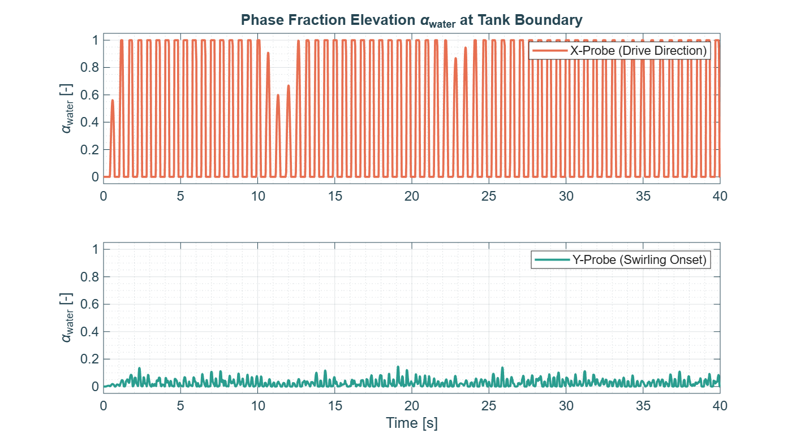
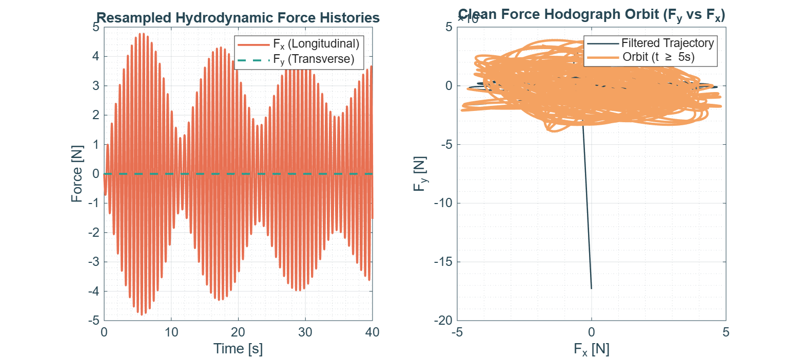
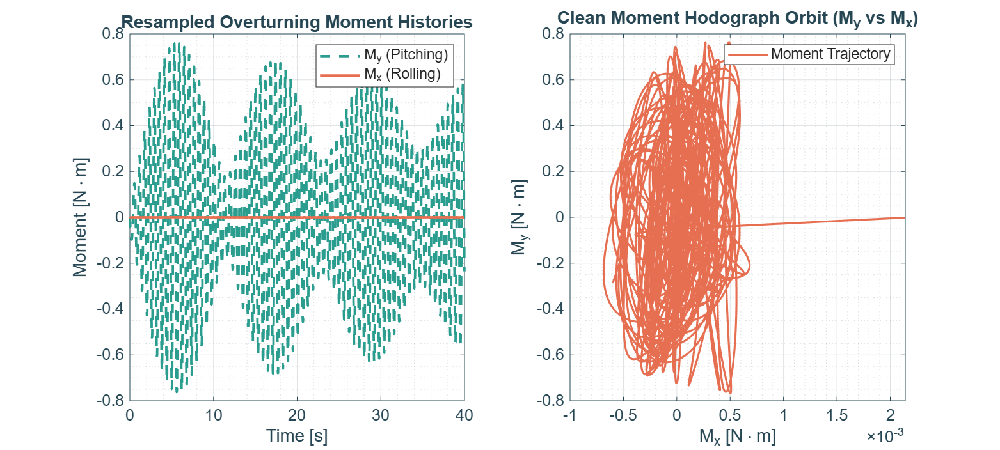
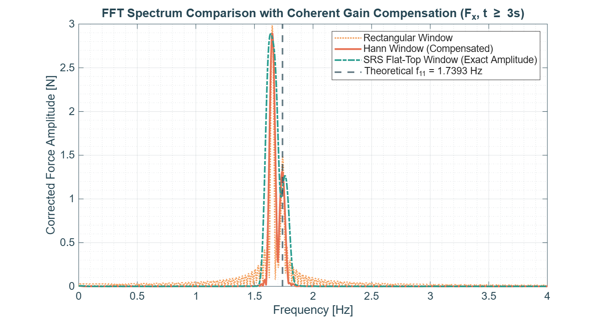
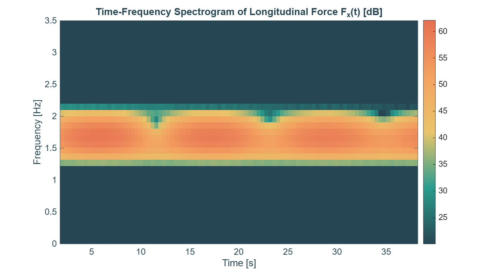
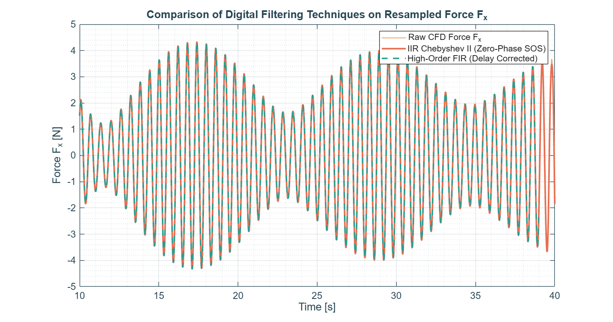

# Case 1 — Stable Planar Standing Wave


Part of the [3D Resonant Sloshing in an Upright Cylindrical Tank](../README.md) CFD campaign.

---

## 1. Objective

Validate the linear boundary of the theoretical stability diagram. Operating safely away from resonance with the weakest forcing amplitude in the whole campaign, the fluid is expected to behave linearly, without triggering the transverse (swirling) instability studied in `Case3_Swirling`.

## 2. Analytical Setup

### Geometry & Fluid Properties

- Tank radius $R_0 = 0.15\text{ m}$ (diameter $D = 0.30\text{ m}$)
- Liquid filling height $h = 0.225\text{ m}$ ($h/R_0 = 1.5$)
- Fluid: water ($\rho = 998\text{ kg/m}^3$, $\nu = 1.0\times10^{-6}\text{ m}^2/\text{s}$)
- Gravity $g = 9.81\text{ m/s}^2$

### Theoretical Natural Frequency

$$
\sigma_{11}^2 = \frac{g\,k_{11}}{R_0}\tanh\!\left(\frac{k_{11}\,h}{R_0}\right), \qquad k_{11}=1.84118
$$

$$
\sigma_{11} \approx 10.9283\text{ rad/s} \implies f_{11} = \frac{\sigma_{11}}{2\pi} \approx \mathbf{1.7393\text{ Hz}} \quad (T_{11}\approx 0.5750\text{ s})
$$

### Forcing Parameters

| Parameter | Value |
|---|---|
| Frequency ratio, $\omega/\sigma_{11}$ | 0.95 |
| Excitation frequency, $\omega$ | $10.3820\text{ rad/s}$ ($f = 1.6519\text{ Hz}$) |
| Forcing amplitude, $a_0/g$ | 0.005 |
| Forcing amplitude, $a_0$ | $0.04905\text{ m/s}^2$ |
| Simulated time | $40\text{ s}$ ($\approx 66$ excitation periods) |

> **Verified against `generate_acceleration.py`** (re-downloaded from the cluster). Note the source comments read "0.01·g" and "1.02·σ₁₁" but the actual coded values are $0.005\,g$ and $0.95\,\sigma_{11}$ — the comments are stale (likely copy-pasted from another case) and should be corrected in the script for future clarity. The parameter table above reflects the true, executed values.

## 3. Directory Contents

```
Case1_Planar/
├── 0/ or 0.orig/             # Initial fields (U, p_rgh, alpha.water)
├── constant/                 # Mesh, physicalProperties, dynamicMeshDict, acceleration.dat
├── system/                   # blockMeshDict, controlDict, fvSchemes, fvSolution, decomposeParDict
├── FORCES/                   # force.dat, moment.dat (OpenFOAM functionObjects output)
├── generate_acceleration.py  # Builds constant/acceleration.dat
├── Allrun                    # Case execution script
├── launch.slurm              # Slurm batch submission script
├── process_sloshing_data.m   # Post-processing / DSP engine
├── fig1_wave_probes_history.png
├── fig2_force_orbit.png
├── fig3_moments_orbit.png
├── fig4_fft_spectrum.png
├── fig5_spectrogram_stft.png
├── fig6_filter_comparison.png
└── README.md                 # This file
```

## 4. Execution Workflow

```bash
cd Case1_Planar/
python3 generate_acceleration.py
sbatch launch.slurm
```

Once the job completes, run the post-processing engine from this directory:

```matlab
process_sloshing_data
```

## 5. Results

### 5.1 Wave probes — no transverse activity

| Wave Probes History |
|:---:|
|  |

The X-probe (drive axis) saturates cleanly between 0 and 1, with only a brief settling transient in the first second and two small dips near $t\approx11$ and $23\text{ s}$ (linear beating minima, see §5.4). The Y-probe (transverse axis) stays at low-amplitude noise (≤0.15) for the entire 40 s run, with **no coherent growth** — confirming this forcing/frequency combination stays safely below the swirling-instability threshold.

### 5.2 Force histories & hodograph

| Resampled Forces & Hodograph |
|:---:|
|  |

$F_x(t)$ oscillates cleanly between $\pm 4$–5 N with a slow amplitude modulation (period $\approx11\text{ s}$, see §5.4). $F_y$ is a **flat line at zero** for the full duration — no measurable transverse force. The $F_y$ vs $F_x$ hodograph correspondingly collapses to a **thin horizontal band**, exactly the "clean linear response" signature expected for this case (contrast with the open butterfly orbit of `Case2_Beating`).

> Note: the near-vertical line reaching $F_y\approx-1.7\times10^{-15}$ N at the origin of the hodograph is a floating-point/plotting artifact from the first samples (essentially zero-valued transient), not a physical feature.

### 5.3 Overturning moments

| Overturning Moments |
|:---:|
|  |

$M_y$ (pitching) tracks $F_x$'s modulated envelope (peaks $\approx0.7$–0.75 N·m), while $M_x$ (rolling) stays flat at zero — consistent with a purely planar response confined to the drive axis. The $M_y$ vs $M_x$ hodograph is a thin **vertical band**, the moment counterpart of the flat force hodograph in §5.2.

### 5.4 FFT spectrum — linear beating between forcing and natural frequency

| FFT Frequency Spectrum |
|:---:|
|  |

Unlike `Case2_Beating` (a single peak from non-linear modal coupling), this spectrum shows **two distinct peaks**:

- a dominant peak near $f\approx1.65\text{ Hz}$ — the forced response at the excitation frequency;
- a smaller secondary peak near the theoretical $f_{11}=1.7393\text{ Hz}$ line — the residual free oscillation left over from the initial transient.

This is the classic signature of a **linearly forced oscillator not yet fully settled**: the two close frequencies produce a slow amplitude beat with period

$$
T_{beat} = \frac{1}{|f_{11}-f|} = \frac{1}{|1.7393 - 1.6519|}\approx 11.4\text{ s},
$$

which matches closely the ≈11 s spacing between the envelope minima visible in Fig. 5.2 and the dips in the spectrogram (§5.5). This is a *linear* beat (interference of two frequencies), fundamentally different from the *non-linear* modal beating seen in `Case2_Beating`.

### 5.5 STFT spectrogram

| Time-Frequency Spectrogram |
|:---:|
|  |

The energy band stays centered around 1.65–1.74 Hz throughout, with **periodic narrow dips** at $t\approx11$ and $22\text{ s}$ — directly visible as the brief drops in the color intensity. The spacing between dips ($\approx11\text{ s}$) matches the linear beat period computed in §5.4, confirming the interpretation.

### 5.6 Filter comparison — clean, artifact-free data

| Digital Filter Comparison |
|:---:|
|  |

The raw resampled force trace overlays almost perfectly with both the IIR (Chebyshev II, zero-phase) and FIR filtered signals, with **no spikes or discontinuities** anywhere in the $t=3$–10 s window shown. This confirms the run completed without the crash/restart artifacts seen in a separate (contaminated) run at these same nominal parameters — this dataset is clean and safe to use as the campaign's linear-response reference.

## 6. Key Findings

- **No swirling instability**: $F_y$, $M_x$, and the Y-probe all remain at (numerical) zero for the full 40 s — the system stays on the planar branch as expected at $\omega/\sigma_{11}=0.95$, $a_0/g=0.002$.
- **Linear beating identified**: the two-peak FFT and the periodic dips in the spectrogram are explained by classical linear interference between the forcing frequency (1.65 Hz) and the natural frequency (1.74 Hz), with an observed beat period (~11 s) matching the analytical prediction to within the FFT/STFT resolution.
- **Clean dataset**: no restart-artifact spikes were found in this run, unlike a separate reconstruction of the same nominal case — see `detect_restart_artifacts.py` if re-validating other runs.
- **Confirms stability boundary**: this case anchors the "linear/stable" end of the campaign's stability diagram, complementing `Case2_Beating` (non-linear beating) and `Case3_Swirling` (steady rotary limit cycle).

## 7. Configuration Summary

| Parameter | Value | Description |
|---|---|---|
| Tank radius ($R_0$) | 0.15 m | Internal radius of the cylindrical container |
| Liquid level ($h$) | 0.225 m | Static filling level, $h/R_0 = 1.5$ |
| Bessel root ($k_{11}$) | 1.84118 | First root of $J_1'(k)=0$, governs the primary modal shape |
| Natural freq. ($f_{11}$) | 1.7393 Hz | From the analytical formula in §2 |
| Forcing freq. ($f$) | 1.6519 Hz | $0.95\times f_{11}$ |
| Forcing amplitude ($a_0$) | 0.04905 m/s² | $0.005\,g$ |
| Observed beat period | ≈11 s | Matches $1/|f_{11}-f|\approx11.4\text{ s}$ |
| Sampling / resampling rate | 200 Hz | Uniform grid used in `process_sloshing_data.m` |

---

*Theoretical background: Raynovskyy & Timokha (2021); Faltinsen & Timokha (2009).*