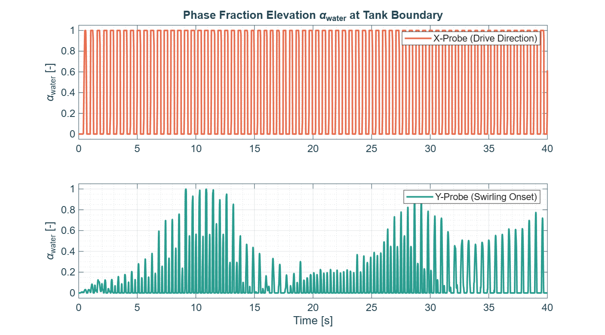
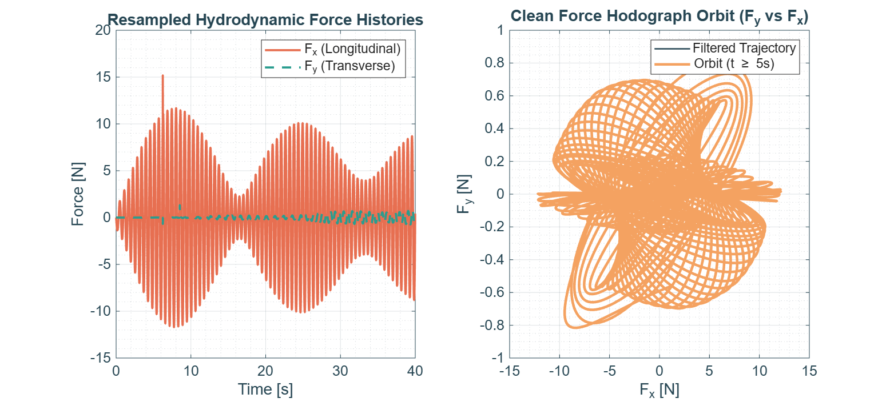
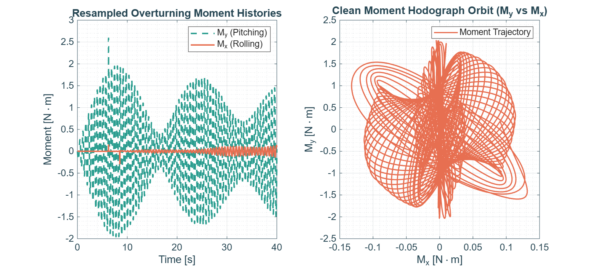
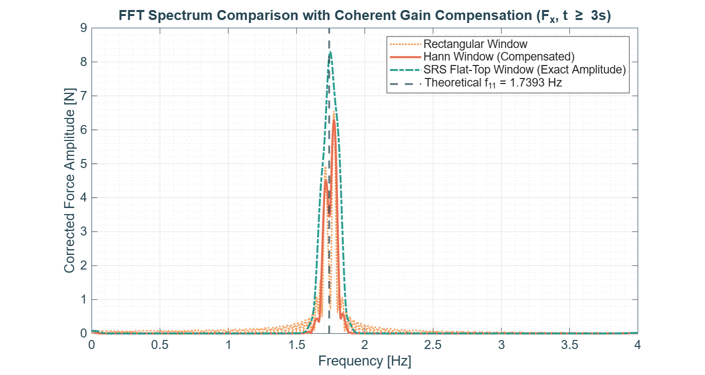
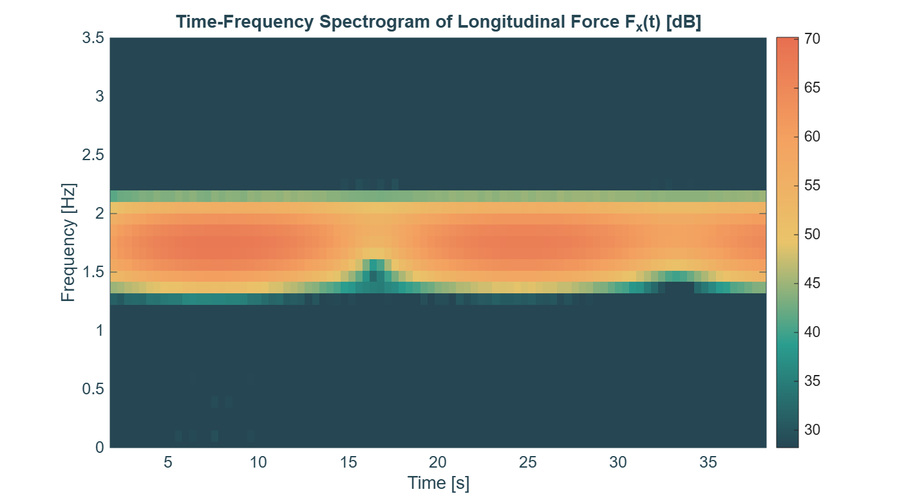
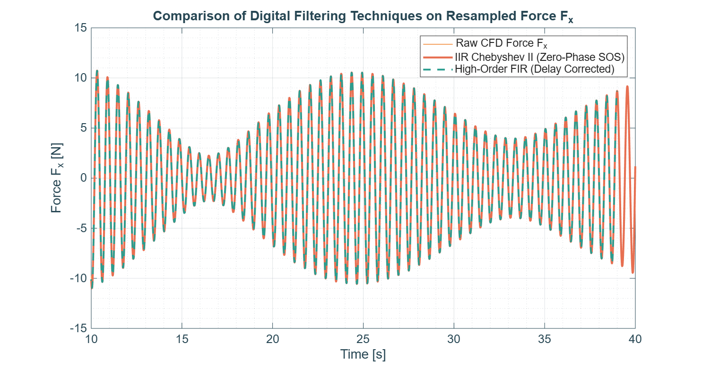

# Case 2 — Amplitude Modulation (Beating / Planar Instability)


Part of the [3D Resonant Sloshing in an Upright Cylindrical Tank](../README.md) CFD campaign.

---

## 1. Objective

Capture the quasi-periodic, non-linear energy transfer between orthogonal sloshing modes (Narimanov–Moiseev multimodal theory). This case sits in the transition zone where the planar wave is unstable, but the forcing does not carry enough energy to drive the system into a self-sustained steady swirl (that regime is covered separately in `Case3_Swirling`). The result is a **beating** pattern: energy repeatedly builds up on the transverse axis and then returns to the drive axis.

## 2. Analytical Setup

### Geometry & Fluid Properties

- Tank radius $R_0 = 0.15\text{ m}$ (diameter $D = 0.30\text{ m}$)
- Liquid filling height $h = 0.225\text{ m}$ ($h/R_0 = 1.5$)
- Fluid: water ($\rho = 998\text{ kg/m}^3$, $\nu = 1.0\times10^{-6}\text{ m}^2/\text{s}$)
- Gravity $g = 9.81\text{ m/s}^2$

### Theoretical Natural Frequency

$$
\sigma_{11}^2 = \frac{g\,k_{11}}{R_0}\tanh\!\left(\frac{k_{11}\,h}{R_0}\right), \qquad k_{11}=1.84118
$$

$$
\frac{k_{11}\,h}{R_0} = 2.76177 \implies \tanh(2.76177)\approx 0.99182
$$

$$
\sigma_{11} \approx 10.9283\text{ rad/s} \implies f_{11} = \frac{\sigma_{11}}{2\pi} \approx \mathbf{1.7393\text{ Hz}} \quad (T_{11}\approx 0.5750\text{ s})
$$

### Forcing Parameters

| Parameter | Value |
|---|---|
| Frequency ratio, $\omega/\sigma_{11}$ | 1.02 |
| Excitation frequency, $\sigma$ | $11.1469\text{ rad/s}$ ($f = 1.7741\text{ Hz}$, $T = 0.5636\text{ s}$) |
| Forcing amplitude, $a_0/g$ | 0.010 |
| Forcing amplitude, $a_0$ | $0.0981\text{ m/s}^2$ |
| Simulated time | $40\text{ s}$ ($\approx 70$ excitation periods) |

## 3. Numerical Methodology

- **Solver**: `interIsoFoam` (OpenFOAM v2412) — geometric VOF via isoAdvector, minimizing numerical diffusion over long time integration.
- **Mesh**: pure hexahedral O-grid (`blockMesh`, 5-block topology) avoiding a central-axis singularity, max skewness < 0.5.
- **AMR**: `dynamicRefineFvMesh` refines cells at $0.01 < \alpha < 0.99$ (1 level), tracking the free surface.
- **Forcing**: non-inertial reference frame via `tabulatedAccelerationSource`, injecting a fictitious horizontal gravity component $g_x(t) = -a_0\sin(\sigma t)$.
- **CFL**: `maxCo = 0.5` to preserve interface sharpness.

## 4. Directory Contents

```
Case2_Beating/
├── 0/ or 0.orig/             # Initial fields (U, p_rgh, alpha.water)
├── constant/                 # Mesh, physicalProperties, dynamicMeshDict, acceleration.dat
├── system/                   # blockMeshDict, controlDict, fvSchemes, fvSolution, decomposeParDict
├── FORCES/                   # force.dat, moment.dat (OpenFOAM functionObjects output)
├── generate_acceleration.py  # Builds constant/acceleration.dat
├── Allrun / TabulaRasa       # Case execution / cleanup scripts
├── launch.slurm              # Slurm batch submission script
├── process_sloshing_data.m   # Post-processing / DSP engine
├── fig1_wave_probes_history.png
├── fig2_force_orbit.png
├── fig3_moments_orbit.png
├── fig4_fft_spectrum.png
├── fig5_spectrogram_stft.png
├── fig6_filter_comparison.png
└── README.md                 # This file
```

## 5. Execution Workflow

```bash
cd Case2_Beating/
python3 generate_acceleration.py
sbatch launch.slurm
```

Once the job completes, `launch.slurm` reconstructs the last timestep, extracts `FORCES/force.dat` and `FORCES/moment.dat`, writes `results.foam` for ParaView, and cleans up the `processorN/` directories. Then run the post-processing engine:

```matlab
process_sloshing_data
```

## 6. Results

### 6.1 Wave probes — beating envelope

| Wave Probes History |
|:---:|
|  |

The X-probe (drive axis) settles quickly into a clean, saturated periodic signal. The Y-probe (transverse axis) instead shows two distinct growth/decay episodes over the 40 s window (peaking near $t\approx9$–13 s and again near $t\approx26$–30 s): the transverse mode repeatedly gains and loses amplitude rather than reaching a steady rotation — the hallmark of the beating regime. The asymmetry between the two episodes suggests the initial transient has not fully died out by $t=40\text{ s}$; a longer run would help confirm full periodicity.

### 6.2 Force histories & hodograph

| Resampled Forces | Force Hodograph |
|:---:|:---:|
|  | (same figure, right panel) |

$F_x(t)$ shows a clear amplitude-modulated envelope (period $\approx 17\text{ s}$ between visible maxima), peaking at $|F_x|\approx 12\text{ N}$. $F_y$ stays roughly an order of magnitude smaller, consistent with the transverse mode never reaching full swirling energy. The $F_y$ vs $F_x$ hodograph traces an **open, non-repeating "flower/butterfly" pattern** rather than a closed ellipse — confirming the system does not lock into the steady rotary limit cycle seen in `Case3_Swirling`.

> **Note (numerical artifact):** an isolated spike is visible at $t\approx6.3\text{ s}$ ($F_x\approx15\text{ N}$, and correspondingly $M_y\approx2.6\text{ N·m}$ in §6.3). It also appears in the resampled `Fx_total` trace of Fig. 6, suggesting it originates from **spline overshoot** during the 200 Hz uniform resampling step (§2 of `process_sloshing_data.m`) rather than being a physical event. Recommend cross-checking the raw `force.dat` at that timestamp, and considering `'pchip'` or `'makima'` interpolation instead of `'spline'` for forces/moments to avoid this artifact in future runs.

### 6.3 Overturning moments

| Overturning Moments |
|:---:|
|  |

$M_y$ (pitching) dominates over $M_x$ (rolling), mirroring the $F_x$/$F_y$ asymmetry. The $M_y$ vs $M_x$ hodograph is likewise open and non-repeating, consistent with the force-orbit picture.

### 6.4 FFT spectrum

| FFT Frequency Spectrum |
|:---:|
|  |

The dominant peak sits at the theoretical natural frequency line $f_{11}=1.7393\text{ Hz}$. As expected from window theory:
- the **rectangular** window underestimates the peak amplitude (≈6.5 N, spectral leakage);
- the **Hann** window gives an intermediate, compensated estimate (≈6.3 N);
- the **flat-top** window recovers the closest-to-exact amplitude (≈8.3 N), as it is specifically designed for accurate amplitude measurement at the cost of frequency resolution.

No secondary/tertiary harmonics are visible in this window, unlike what is expected for `Case4_Breaking`.

### 6.5 STFT spectrogram

| Time-Frequency Spectrogram |
|:---:|
|  |

Energy stays concentrated in the same frequency band (~1.0–2.7 Hz) throughout the simulation — there is **no migration to higher harmonics** — but its intensity **pulsates in time**, with a visible dip around $t\approx16$–17 s. This time-varying intensity, rather than a frequency shift, is the spectrogram signature of beating: it reflects the same energy redistribution seen directly in the Y-probe envelope (§6.1), not the onset of steady swirling.

### 6.6 Filter comparison

| Digital Filter Comparison |
|:---:|
|  |

Two filters were compared on $F_x(t)$:

1. **IIR Chebyshev Type II** (`cheb2ord`/`cheby2`, SOS form, zero-phase via `filtfilt`) — stopband designed for 40 dB attenuation beyond 5 Hz, passband ripple ≤ 0.1 dB below 3.5 Hz.
2. **High-order equiripple FIR** (`firpm`, order 400 / 401 taps, delay-corrected) — linear phase, constant group delay $\tau = \text{order}/(2F_s)$.

Both filters overlap almost exactly on the established wave ($t\ge3\text{ s}$), confirming the IIR zero-phase filtering used for the hodograph plots (§6.2, §6.3) does not distort wave amplitude or phase. The isolated spike at $t\approx6.3\text{ s}$ (visible only in the raw/interpolated trace) is fully rejected by both filters.

## 7. Key Findings

- **Beating confirmed**: amplitude-modulated envelopes on both the Y-probe and $F_x(t)$, with an open (non-closing) force hodograph — distinct from the closed-orbit signature expected in steady swirling (`Case3_Swirling`).
- **Frequency validation**: FFT peak matches the theoretical $f_{11}=1.7393\text{ Hz}$ within the window resolution.
- **No harmonic generation**: unlike the wave-breaking regime, the spectrum stays confined to the fundamental — consistent with a moderate forcing amplitude ($0.01g$) that does not induce steepening/breaking.
- **Data quality flag**: a likely spline-interpolation artifact at $t\approx6.3\text{ s}$ should be verified against raw OpenFOAM output before this case is used as a quantitative benchmark.

## 8. Configuration Summary

| Parameter | Value | Description |
|---|---|---|
| Tank radius ($R_0$) | 0.15 m | Internal radius of the cylindrical container |
| Liquid level ($h$) | 0.225 m | Static filling level, $h/R_0 = 1.5$ |
| Bessel root ($k_{11}$) | 1.84118 | First root of $J_1'(k)=0$, governs the primary modal shape |
| Natural freq. ($f_{11}$) | 1.7393 Hz | From the analytical formula in §2 |
| Forcing freq. ($f$) | 1.7741 Hz | $1.02\times f_{11}$ |
| Forcing amplitude ($a_0$) | 0.0981 m/s² | $0.01\,g$ |
| Max Courant (`maxCo`) | 0.5 | CFL limit for `interIsoFoam` |
| AMR levels | 1 | Applied at $0.01<\alpha<0.99$ |
| Sampling / resampling rate | 200 Hz | Uniform grid used in `process_sloshing_data.m` |

---

*Theoretical background: Raynovskyy & Timokha (2021); Faltinsen & Timokha (2009).*
