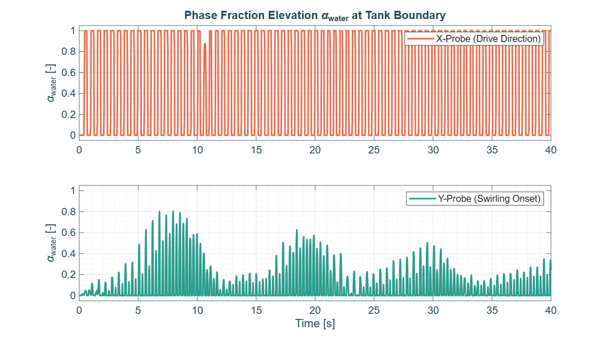
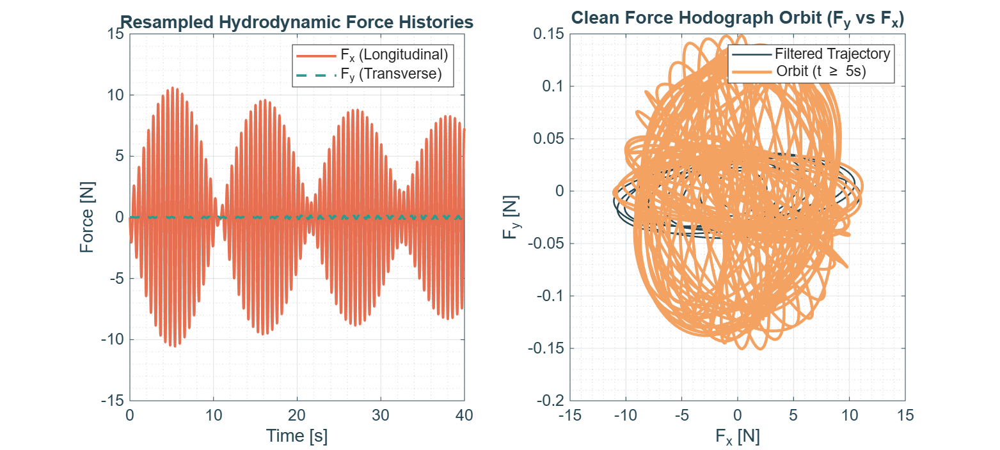
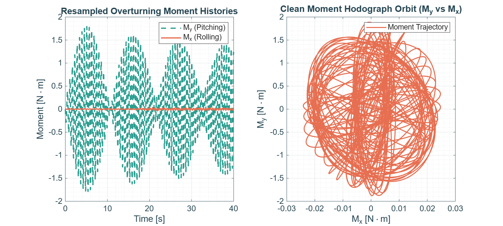
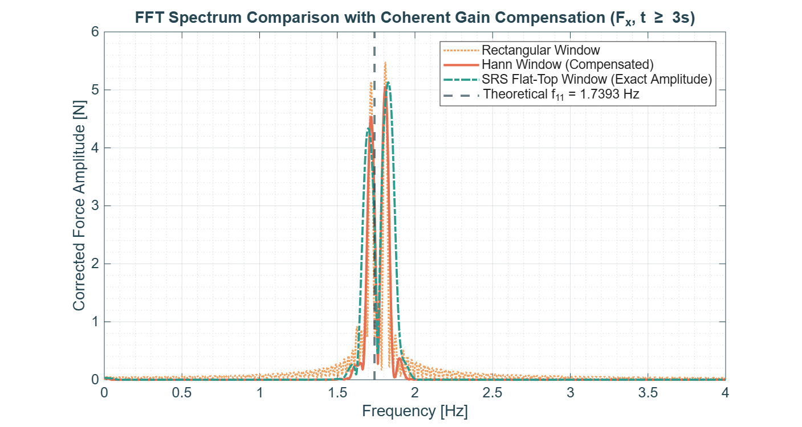
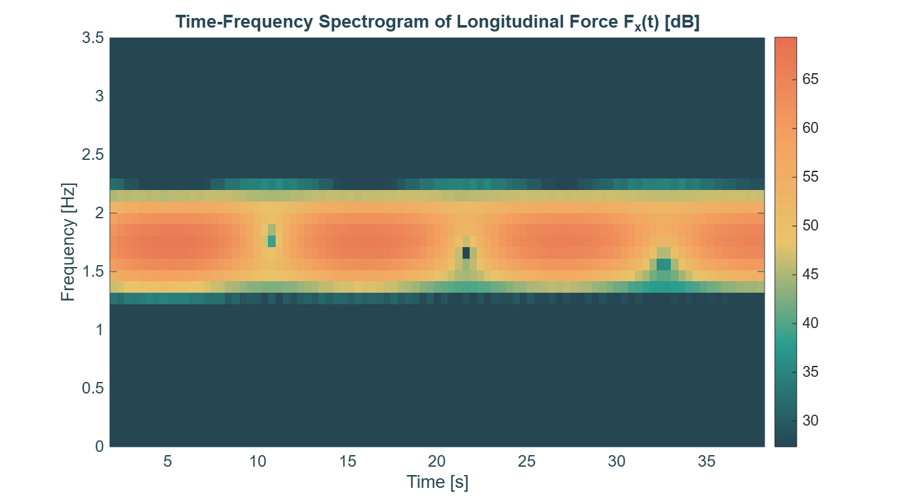
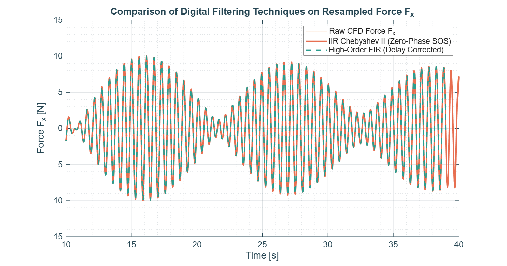

# Case 3 — Steady Rotary Swirling


-yellow.svg)

Part of the [3D Resonant Sloshing in an Upright Cylindrical Tank](../README.md) CFD campaign.

---

## 1. Objective

Simulate the non-linear limit cycle in which the liquid detaches from the excitation axis and rotates continuously along the cylindrical wall — relevant to spacecraft propellant tank design, where steady swirling generates severe centrifugal loads and sustained angular momentum.

## 2. Analytical Setup

### Theoretical Natural Frequency

$$
\sigma_{11} \approx 10.9283\text{ rad/s} \implies f_{11}\approx\mathbf{1.7393\text{ Hz}}
$$

### Forcing Parameters

| Parameter | Value |
|---|---|
| Frequency ratio, $\omega/\sigma_{11}$ | 1.04 |
| Excitation frequency, $\omega$ | $11.3654\text{ rad/s}$ ($f = 1.8089\text{ Hz}$) |
| Forcing amplitude, $a_0/g$ | 0.015 |
| Forcing amplitude, $a_0$ | $0.14715\text{ m/s}^2$ |
| Simulated time | $40\text{ s}$ ($\approx 72$ excitation periods) |
| Y-axis trigger | fading 1% $a_0$ perturbation, first 2 s (per `generate_acceleration.py`) |

## 3. Directory Contents

```
Case3_Swirling/
├── 0/ or 0.orig/
├── constant/                 # incl. acceleration.dat (with Y-trigger)
├── system/
├── FORCES/
├── generate_acceleration.py
├── Allrun
├── launch.slurm
├── process_sloshing_data.m
├── fig1_wave_probes_history.png
├── fig2_force_orbit.png
├── fig3_moments_orbit.png
├── fig4_fft_spectrum.png
├── fig5_spectrogram_stft.png
├── fig6_filter_comparison.png
└── README.md
```

## 4. Execution Workflow

```bash
cd Case3_Swirling/
python3 generate_acceleration.py
sbatch launch.slurm
process_sloshing_data   # MATLAB, run from this directory
```

## 5. Results

### 5.1 Wave probes — repeated growth/decay, not a locked rotation

| Wave Probes History |
|:---:|
|  |

The X-probe saturates cleanly, with a single dip near $t\approx11\text{ s}$. The Y-probe shows **four successive growth/decay episodes** (peaking near $t\approx7$, $18$, $29$, and $39\text{ s}$), with **decreasing peak amplitude each cycle** (≈0.8 → 0.6 → 0.5 → 0.3). This is *not* the signature expected for steady swirling — a locked rotation would show the Y-probe saturating and staying near 1, in phase quadrature with the X-probe, without decaying.

### 5.2 Force histories & hodograph

| Resampled Forces & Hodograph |
|:---:|
|  |

$F_x(t)$ shows a clear amplitude-modulated envelope (period $\approx11\text{ s}$, minima near $t\approx0,11,22,33\text{ s}$), reaching $|F_x|\approx11\text{ N}$. $F_y$ stays essentially flat/negligible in this view. The hodograph is a dense, **non-closing "flower" pattern** — not the clean circular/elliptical closed orbit expected once steady swirling is established. A small, tighter loop is visible near the origin (the "Filtered Trajectory" in dark navy), but it does not dominate the orbit.

### 5.3 Overturning moments

| Overturning Moments |
|:---:|
|  |

$M_y$ (pitching) again dominates with the same ≈11 s amplitude modulation as $F_x$; $M_x$ (rolling) stays close to zero throughout. The $M_y$ vs $M_x$ hodograph mirrors the force hodograph: a large, open, non-repeating flower rather than a closed loop.

### 5.4 FFT spectrum — two competing peaks

| FFT Frequency Spectrum |
|:---:|
|  |

Two distinct peaks are visible, straddling the theoretical $f_{11}=1.7393\text{ Hz}$ line:

- a peak near the **natural frequency** ($\approx1.74\text{ Hz}$);
- a peak near the **forcing frequency** ($\approx1.81\text{ Hz}$), slightly taller in the uncompensated (rectangular) window.

Both peaks coexist with comparable energy — the spectrum has **not collapsed onto a single dominant frequency**, which is what would be expected once the system locks into a steady, periodic swirling limit cycle (a pure rotation at a single frequency with a fixed 90° phase relationship between $F_x$ and $F_y$).

### 5.5 STFT spectrogram

| Time-Frequency Spectrogram |
|:---:|
|  |

Confirms the picture from §5.1–5.2: three narrow dips in energy at $t\approx11$, $21$, and $32\text{ s}$ (spacing ≈10–11 s), matching the force-envelope minima. The dips get progressively shallower/narrower over time (less pronounced by $t=32\text{ s}$ than at $t=11\text{ s}$), consistent with the decaying-amplitude beating seen on the Y-probe — but the pattern never disappears into a flat, steady band, which is what full swirling lock-in would look like.

### 5.6 Filter comparison — clean data

| Digital Filter Comparison |
|:---:|
|  |

Raw and filtered ($t=3$–10 s) traces overlap closely with no spikes or restart artifacts — this run is numerically clean, so the results below reflect genuine flow physics, not data-quality issues.

## 6. Key Findings — ⚠️ Swirling not fully established

Unlike the "textbook" expectation for $\omega/\sigma_{11}=1.04$, $a_0/g=0.015$ (see the campaign-level stability diagram), **this run does not show a converged steady rotary limit cycle** within the simulated 40 s window:

- The Y-probe, force hodograph, and moment hodograph all show a **repeating, decaying beating pattern** rather than a closed circular orbit or a stable 90°-phase-locked oscillation.
- The FFT retains **two comparable peaks** (natural + forcing) instead of collapsing to the single swirling frequency.
- The decaying trend in the Y-probe peaks (0.8 → 0.3 over 4 cycles) could mean either:
  1. the system is **slowly converging** toward steady swirling and simply needs a longer simulated time to lock in (the fading 1% Y-trigger only acts for the first 2 s — it may not be enough to seed a persistent limit cycle at this exact frequency ratio); or
  2. these parameters sit **near the swirling-stability boundary** rather than solidly inside it, so the system oscillates between planar-dominated and swirl-attempting states without ever locking in (a "pre-swirling" transitional regime).

**Recommendation:** re-run with an extended simulation time (e.g. 80–100 s) and/or a stronger/longer Y-axis trigger before treating this case as the campaign's definitive steady-swirling reference. As-is, this dataset is valuable as evidence of the *transition* dynamics near the swirling threshold, but should not be captioned as "steady rotary swirling achieved."

## 7. Configuration Summary

| Parameter | Value |
|---|---|
| Natural freq. ($f_{11}$) | 1.7393 Hz |
| Forcing freq. ($f$) | 1.8089 Hz ($1.04\times f_{11}$) |
| Forcing amplitude ($a_0$) | 0.14715 m/s² ($0.015\,g$) |
| Y-trigger | fading, 1% $a_0$, $t\in[0,2]\text{ s}$ |
| Observed envelope period | ≈11 s (Fx, moments, Y-probe, spectrogram all consistent) |
| Y-probe peak trend over 4 cycles | 0.8 → 0.6 → 0.5 → 0.3 (decaying) |
| Data quality | Clean — no restart artifacts (§5.6) |

---

*Theoretical background: Raynovskyy & Timokha (2021); Faltinsen & Timokha (2009).*
