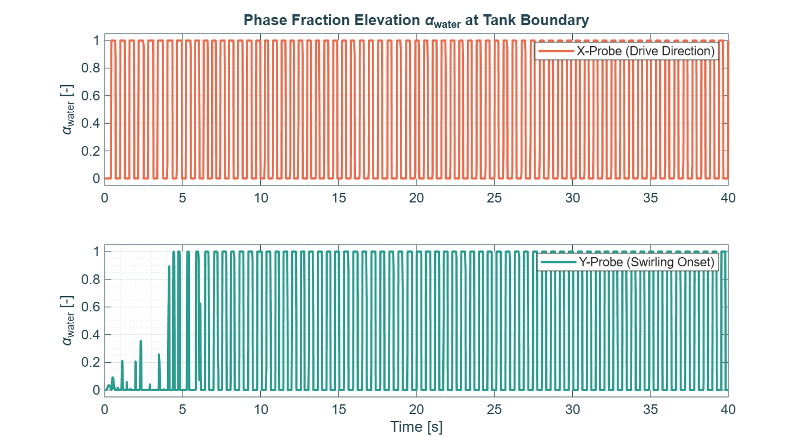
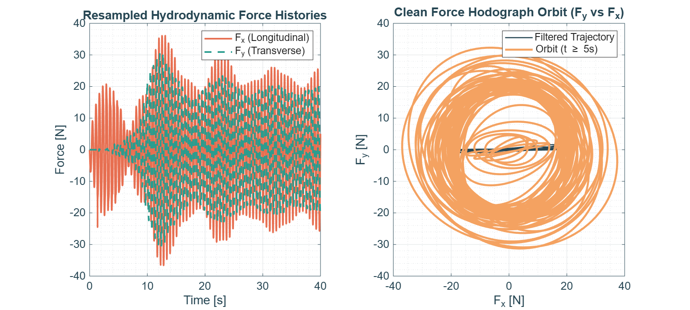
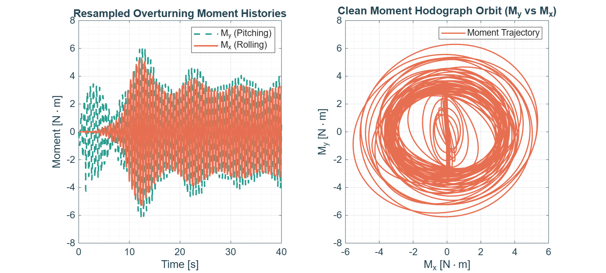
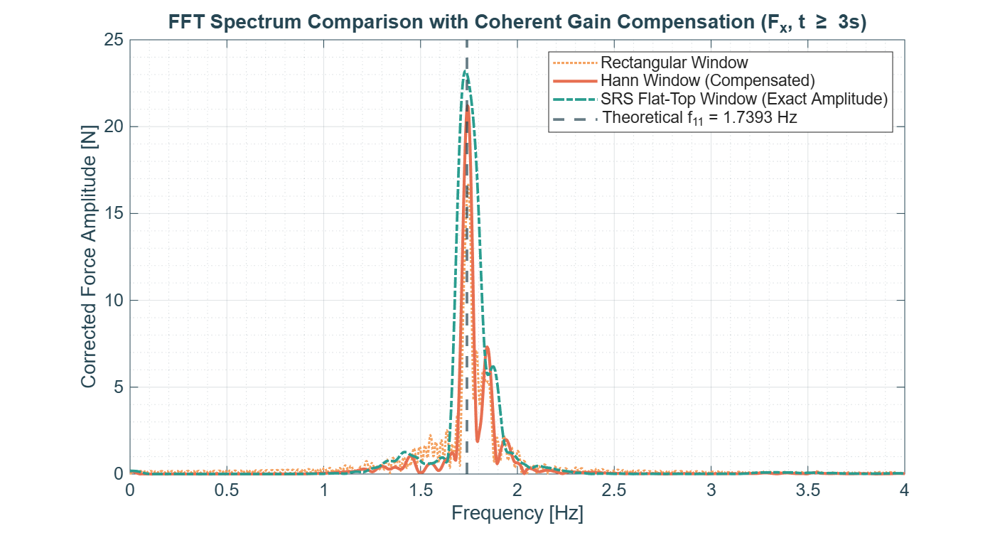
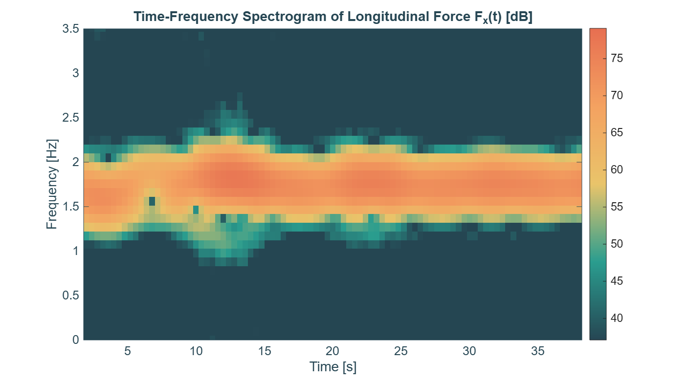
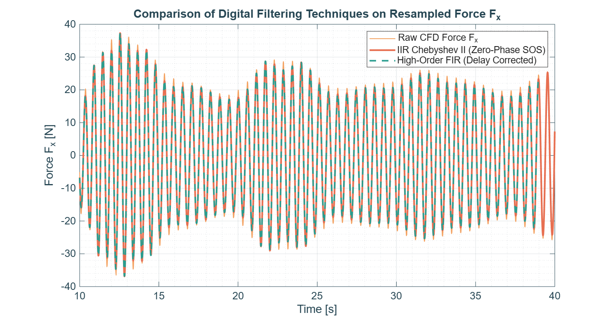

# Case 4 — Violent Chaotic Sloshing & Wave Breaking


Part of the [3D Resonant Sloshing in an Upright Cylindrical Tank](../README.md) CFD campaign.

---

## 1. Objective

Push `interIsoFoam` to its limits by operating at exact resonance with the largest forcing amplitude in the campaign. Studies the highly dissipative, non-linear nature of wave breaking — and, as it turns out, its interaction with the planar-to-3D instability boundary (see §6).

## 2. Analytical Setup

### Geometry & Fluid Properties

- Tank radius $R_0 = 0.15\text{ m}$ (diameter $D = 0.30\text{ m}$)
- Liquid filling height $h = 0.225\text{ m}$ ($h/R_0 = 1.5$)
- Fluid: water ($\rho = 998\text{ kg/m}^3$, $\nu = 1.0\times10^{-6}\text{ m}^2/\text{s}$)
- Gravity $g = 9.81\text{ m/s}^2$

### Theoretical Natural Frequency

$$
\sigma_{11}\approx 10.9283\text{ rad/s} \implies f_{11}\approx\mathbf{1.7393\text{ Hz}} \quad (T_{11}\approx 0.5750\text{ s})
$$

### Forcing Parameters (verified against `generate_acceleration.py`)

| Parameter                              | Value                                                    |
| -------------------------------------- | -------------------------------------------------------- |
| Frequency ratio,$\omega/\sigma_{11}$ | 1.00 (exact resonance)                                   |
| Excitation frequency,$\omega$        | $10.9283\text{ rad/s}$ ($f=f_{11}=1.7393\text{ Hz}$) |
| Forcing amplitude,$a_0/g$            | 0.050 — the strongest in the campaign                   |
| Forcing amplitude,$a_0$              | $0.4905\text{ m/s}^2$                                  |
| Simulated time                         | $40\text{ s}$ ($\approx70$ excitation periods)       |

`generate_acceleration.py` was checked line-by-line: both the in-code values and the comments agree with the table above — no discrepancy found for this case.

## 3. Directory Contents

```
Case4_Breaking/
├── 0/ or 0.orig/             # Initial fields (U, p_rgh, alpha.water)
├── constant/                 # Mesh, physicalProperties, dynamicMeshDict, acceleration.dat
├── system/                   # blockMeshDict, controlDict, fvSchemes, fvSolution, decomposeParDict
├── FORCES/                   # force.dat, moment.dat (OpenFOAM functionObjects output)
├── generate_acceleration.py  # Builds constant/acceleration.dat
├── Allrun                    # Case execution script
├── (launch.slurm)             # Slurm script used on our cluster — site-specific, not tracked in git
├── process_sloshing_data.m   # Post-processing / DSP engine
├── fig1_wave_probes_history.png
├── fig2_force_orbit.png
├── fig3_moments_orbit.png
├── fig4_fft_spectrum.png
├── fig5_spectrogram_stft.png
├── fig6_filter_comparison.png
└── README.md                 # This file
```

## 4. Execution Workflow

```bash
cd Case4_Breaking/
python3 generate_acceleration.py
./Allrun   # or wrap in your own Slurm/PBS submission script — see root README's Execution Workflow
```

> Given the mesh distortion expected during wave breaking, monitor the AMR (`dynamicRefineFvMesh`) refinement levels closely and expect a longer wall-clock time than the other cases.

```matlab
process_sloshing_data
```

## 5. Results

### 5.1 Wave probes — breaking on both axes

|             Wave Probes History             |
| :------------------------------------------: |
|  |

Both the X-probe **and** the Y-probe saturate fully between 0 and 1 after $t\approx5\text{ s}$ — not just the drive axis. This indicates the free surface is breaking/splashing broadly around the tank circumference, not a wave confined to a single plane.

### 5.2 Force histories & hodograph

|     Resampled Forces & Hodograph     |
| :----------------------------------: |
|  |

$F_x(t)$ reaches peaks up to **≈37 N** — nearly 8× the peak amplitude seen in `Case2_Beating`. Critically, $F_y$ (transverse) has grown to **the same order of magnitude as $F_x$**, no longer negligible as in the lower-amplitude cases. The $F_y$ vs $F_x$ hodograph is a **blurred, chaotic ring** rather than a clean orbit — the signature of a genuinely 3D, non-planar force response.

### 5.3 Overturning moments

|        Overturning Moments        |
| :--------------------------------: |
|  |

$M_x$ and $M_y$ are likewise comparable in magnitude, and the moment hodograph mirrors the force hodograph's chaotic ring structure — confirming the 3D character of the response at the moment level too.

### 5.4 FFT spectrum — nonlinear detuning, not clean harmonics

|         FFT Frequency Spectrum         |
| :------------------------------------: |
|  |

> **Correction vs. the original case plan**: this case was expected to show clean $2\omega$/$3\omega$ super-harmonics from crest steepening. The actual spectrum does **not** show that. Instead there is a **broadened dominant peak** centered on $f_{11}$ (≈23 N with the flat-top window) plus a **close satellite peak** near ≈1.85 Hz — much closer in frequency than a $2\omega$ harmonic would be. This is more consistent with **non-linear resonance detuning** (amplitude-dependent frequency shift, a Stokes-type hardening/softening effect) than with harmonic generation in the strict sense.

### 5.5 STFT spectrogram

|        Time-Frequency Spectrogram        |
| :---------------------------------------: |
|  |

The energetic band (≈1.5–2.3 Hz) stays broad and largely stationary in time, rather than showing energy migrating upward into distinct harmonic bands — consistent with the detuning interpretation in §5.4 rather than a harmonic ladder.

### 5.6 Filter comparison — clean data

|            Digital Filter Comparison            |
| :----------------------------------------------: |
|  |

Raw and filtered traces overlay closely across $t=10$–40 s with no restart-artifact spikes — this run is clean and usable as-is.

## 6. Key Findings

- **Not a purely planar breaking wave**: $F_y$ and $M_x$ grow to the same order as $F_x$ and $M_y$, and both wave probes saturate — the response is genuinely 3D, not confined to the drive axis.
- **Physical interpretation, not a bug**: at exact resonance ($\omega/\sigma_{11}=1.00$) with the campaign's largest forcing amplitude ($a_0/g=0.05$), stability theory (Miles / Faltinsen–Timokha) predicts the planar branch becomes unstable even at resonance, allowing energy transfer into transverse modes. What's observed here is consistent with **wave breaking and planar-branch instability occurring together**, rather than a clean breaking wave that stays planar.
- **Spectral signature revised**: expect non-linear resonance **detuning** (broadened/shifted peak) as the dominant spectral feature of this regime, not sharp $2\omega/3\omega$ harmonics — the original case-plan expectation should be corrected accordingly for the campaign README.
- **Clean dataset**: no restart artifacts detected; this run can be used as-is for quantitative analysis.

## 7. Configuration Summary

| Parameter                   | Value                | Description                                      |
| --------------------------- | -------------------- | ------------------------------------------------ |
| Tank radius ($R_0$)       | 0.15 m               | Internal radius of the cylindrical container     |
| Liquid level ($h$)        | 0.225 m              | Static filling level,$h/R_0 = 1.5$             |
| Natural freq. ($f_{11}$)  | 1.7393 Hz            | From the analytical formula in §2               |
| Forcing freq. ($f$)       | 1.7393 Hz            | $1.00\times f_{11}$, exact resonance           |
| Forcing amplitude ($a_0$) | 0.4905 m/s²         | $0.05\,g$ — strongest forcing in the campaign |
| Peak$F_x$ observed        | ≈37 N               | See §5.2                                        |
| Peak$F_y$ observed        | Comparable to$F_x$ | 3D, non-planar response (§5.2, §6)             |
| Sampling / resampling rate  | 200 Hz               | Uniform grid used in`process_sloshing_data.m`  |

---

*Theoretical background: Raynovskyy & Timokha (2021); Faltinsen & Timokha (2009).*
